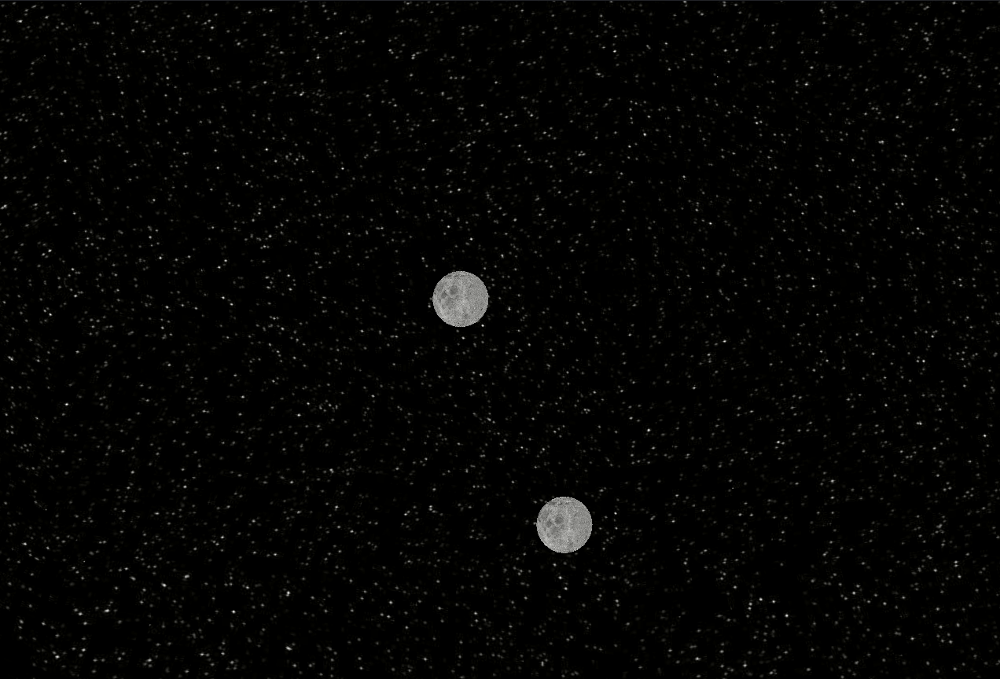
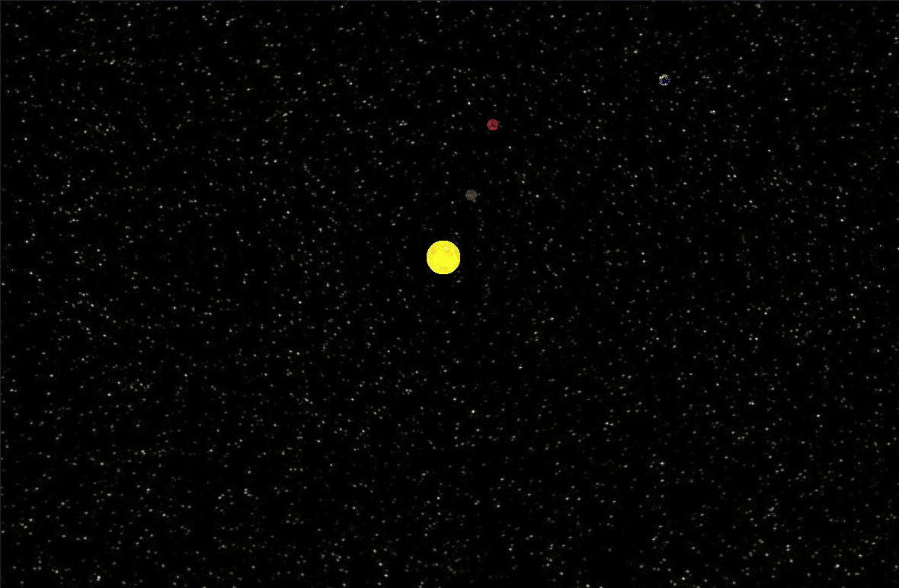

# Graviational Field Simulator
Easy to use environment allowing to place physic bodies in space and watch how they behave.

## Features
### Adding bodies
You can use our pre-defined planet objects like earth or sun.

### Adding bigger number of objects
Things turn exciting when it is possible to observe multiple objects reacting to each other.

## How to use it
### Dependencies
This project requires Python 3 with Panda3d, scipy and numpy

### Default simulation
Clone this repo on your local machine and go into project folder

    git clone https://github.com/FranciszekPin/gravity-field-simulator
    cd gravity-field-simulator

To see default simulation just run

    python3 GameManager.py

You should see few planets orbiting sun

### Making own simulation
In `BallsManager.py` there is function `add_balls_to_render(self)`. 
Inside this function you can set planets for simulation.
There are two functions that can be used. 
#### Add single planet
First adds one planet with given mass and velocity on given position:

    add_ball(self, position, velocity, static, mass, planet_name)

where
    
    position - starting position of planet in numpy.array([x, y, z])
    position - starting velocity of planet in numpy.array([x, y, z])
    static - if True, planet won't move, usually should be set to False
    mass - single number standing for plaet mass
    planet_name - sets planet texture with according name, the possible values are: "earth", "mercury", "mars", "moon"

For example:

    self.add_ball(numpy.array([0., 0., 0.]), numpy.array([0, 0.0, 0.0]), False, 333000, "sun")

Adds physic body with sun texture on position with coordinates [0, 0, 0], velocity vector [0, 0, 0], not static, with mass 333000 Kg

#### Add multiple planets
It is possible to place multiple planets at the same time. 
Function `add_planet_square()` makes "square" of planets specified by position, border size and distance between neighboring planets

    add_planet_square(self, position, size, distance_between_planets)

For example:

    self.add_planet_square(numpy.array([0., 0., 100]), 40, 10)

Places square of planets with border 40, position [0, 0, 100] and distance between planets equal to 10